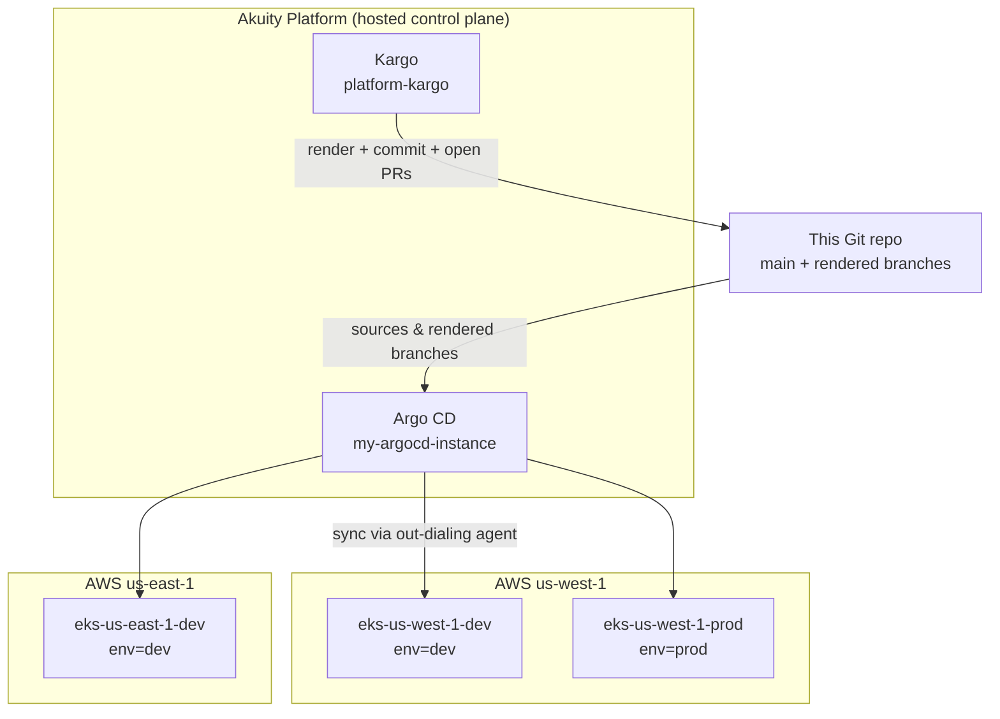
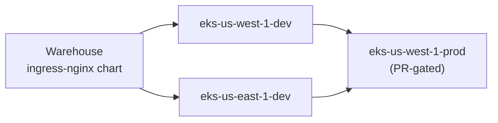
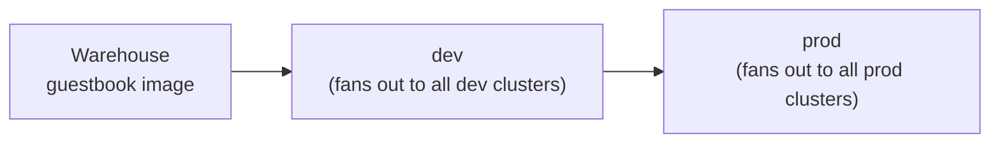

# Kargo Quickstart, extended: a multi-region GitOps fleet on the Akuity Platform

This repository began as the [Akuity Kargo Quickstart](https://docs.akuity.io/tutorials/kargo-quickstart/),
a single guestbook application promoted image-by-image on one cluster, and grows
it into a small platform: an Akuity-hosted Argo CD and Kargo control plane driving
a three-cluster, two-region EKS fleet, with two deliberately different Kargo
promotion patterns. The EKS fleet is provisioned with Terraform; the Akuity
resources were stood up with the Akuity and Kargo CLIs (a Terraform proof-of-concept
for the Akuity side is included but was not used, see below).

One caveat up front: the fleet is three clusters because the Akuity Pro trial caps
Argo CD clusters at three. Ideally I'd have six or more to properly demo the design.
With that headroom we'd see two clusters per tier (dev, staging, & prod), each tier's
clusters in separate regions. It would show the contrast between the two promotion models
far more fully. As built, the dev tier fans out across two regions while the prod tier is a single
cluster, so the prod fan-out is demonstrated in shape but not in numbers. Staging is omitted altogether.
Read the promotion patterns below with that constraint in mind.

The assignment asks for at least one beneficial change. I've made several,
organized around a single theme: showing how Akuity and Kargo handle the
two kinds of workloads platform and development teams run (a **business application** and a
**shared kubernetes platform component**) and why their promotion models should differ.

## Contents

- [TL;DR](#tldr)
- [Architecture and overall design](#architecture-and-overall-design)
  - [The Rendered Manifests Pattern](#the-rendered-manifests-pattern)
  - [Pattern A: the platform component (cluster-centric)](#pattern-a-the-platform-component-cluster-centric)
  - [Pattern B: the business application (environment-centric)](#pattern-b-the-business-application-environment-centric)
  - [ApplicationSets](#applicationsets)
- [Key design decisions and tradeoffs](#key-design-decisions-and-tradeoffs)
- [Assumptions](#assumptions)
- [Experience: friction, defects, and feedback](#experience-friction-defects-and-feedback)
- [Bonus items explored](#bonus-items-explored)
- [Status, limitations, and next steps](#status-limitations-and-next-steps)
- [Repository layout](#repository-layout)
- [Setup: how to deploy](#setup-how-to-deploy)
  - [Prerequisites](#prerequisites)
  - [1. Build the EKS fleet (Terraform)](#1-build-the-eks-fleet-terraform)
  - [2. Onboard Akuity (Argo CD instance, cluster registrations, agents, appsets)](#2-onboard-akuity-argo-cd-instance-cluster-registrations-agents-appsets)
  - [3. Apply the Kargo resources](#3-apply-the-kargo-resources)
  - [4. Promote](#4-promote)
  - [How the Akuity resources were stood up (CLI, not Terraform)](#how-the-akuity-resources-were-stood-up-cli-not-terraform)
  - [Terraform: per-root reference](#terraform-per-root-reference)

## TL;DR

- **Akuity control plane:** hosted Argo CD (`my-argocd-instance`, v3.4.3) and Kargo
  (`platform-kargo`, v1.10.7).
- **Fleet:** three EKS clusters across two regions, a dev tier in `us-west-1` and
  `us-east-1`, and a prod tier in `us-west-1`.
- **Two Kargo projects, two promotion patterns:**
  - `kargo-simple` (guestbook) is **environment-centric**: a developer promotes
    `dev -> prod` and the cluster count is hidden from them; one promotion fans out
    to every cluster in the tier.
  - `platform-addons` (ingress-nginx) is **cluster-centric**: an operator promotes
    each cluster explicitly, and prod is PR-gated.
- Both pipelines use the [Rendered Manifests Pattern](https://akuity.io/blog/the-rendered-manifests-pattern).
- `terraform/eks` provisions the EKS fleet (used). `terraform/akuity` is a
  proof-of-concept for IaC-managing the Akuity resources; the actual stand-up used
  the Akuity/Kargo CLIs, not Terraform.

## Architecture and overall design

Three layers cooperate:

1. **The Akuity Platform** hosts the Argo CD and Kargo control planes. Nothing
   runs them in-cluster; the workload clusters only run a lightweight agent that
   dials out to Akuity.
2. **This Git repository** is the single source of truth. `main` holds the
   sources (Helm chart, Kustomize overlays) and the platform config; the rendered
   branches hold the plain YAML that Argo CD actually applies. I'd expect application
   development/operations teams to have separate repos from the infrastructure/platform team(s),
   but to keep things simple I've aggregated everything into one repo.
3. **The EKS fleet** receives workloads. Each cluster carries an `env` label
   (`dev` or `prod`) that the ApplicationSets and Kargo stages route on.



### The Rendered Manifests Pattern

Every promotion in this repo follows the same shape. Kargo clones `main`, renders
the source (a `helm template` for the add-on, a `kustomize build` for guestbook)
into a single plain-YAML file, commits that to a target branch, and points the
relevant Argo CD Application at the new commit. Argo CD only ever syncs fully
rendered YAML.

This keeps templating logic out of the live sync path, makes every change a
reviewable Git diff of concrete Kubernetes objects, and lets each cluster pin a
different rendered revision during a rollout. It is also what makes the two
promotion patterns below possible without changing how Argo CD behaves.

### Pattern A: the platform component (cluster-centric)

`platform-addons` manages the ingress-nginx add-on as an umbrella Helm chart. A
Kargo Warehouse subscribes to the upstream ingress-nginx chart; new chart versions
become Freight. Each Stage is a single cluster, chained so prod sits downstream of
the dev tier:



Both dev cluster stages draw Freight directly from the Warehouse, so the operator
promotes each cluster explicitly and can canary `eks-us-west-1-dev`, watch it, then
advance `eks-us-east-1-dev`. The prod cluster stage sources from the two dev cluster
stages, so it only ever sees Freight that has already cleared a dev cluster. Each
stage renders the chart, pushes to its own `cluster/<cluster-name>` branch, and updates
only its cluster's Application. Prod is **PR-gated**: its stage opens a pull request
into the cluster branch and waits for merge before Argo CD syncs, giving a human
approval gate on production change.

This is how you want a shared component to behave. Ingress is blast-radius
sensitive, so an operator wants explicit, observable control over each cluster.

### Pattern B: the business application (environment-centric)

`kargo-simple` manages guestbook, promoting a container image through Kustomize
overlays. Its Stages are the inverse of the add-on: a stage is an **environment**,
and the clusters are abstracted away from the developer.



There are only two stages. The `dev` stage renders the dev overlay once, pushes to
a shared `appenv/dev` branch, and its `argocd-update` step targets **every**
Application labelled `app=guestbook, env=dev` in one shot. Kargo waits for all of
them to reach the new revision and report Healthy before the promotion succeeds.
The developer promotes `dev -> prod` and never names a cluster; adding a third dev
cluster later changes nothing in their workflow.

This is how an application team wants to ship: think in environments, let the
platform decide where "dev" physically is.

### ApplicationSets

A single Argo CD `clusters` generator per project produces one Application per
cluster, keyed off the cluster name and `env` label. For the add-on, each app
tracks its own `cluster/<cluster-name>` branch and authorizes its own cluster stage; for
guestbook, each app tracks the shared `appenv/<tier>` branch and authorizes the tier
stage. Registering or removing a cluster automatically adds or prunes its
Applications, with no edits to the appsets. That property is what made the
fleet-size changes during this build (4 clusters down to 3) a one-line change.

## Key design decisions and tradeoffs

**Two promotion patterns, on purpose.** The headline decision is modelling the same
fleet two ways. A platform component (ingress) gets cluster-by-cluster control with
a prod PR gate; a business application (guestbook) gets environment-level
promotions that hide the clusters. This mirrors how the two teams actually think,
and it shows that Kargo's Stage graph is flexible enough to express both without
bending Argo CD. The tradeoff is more moving parts than the single linear pipeline
the tutorial ships, in exchange for a design that scales to a real org.

**Rendered Manifests Pattern everywhere.** Argo CD only syncs plain YAML, so the
live diff is always concrete objects, templating failures surface at promotion
time rather than sync time, and per-cluster revisions are possible. The cost is an
extra branch family (`cluster/*`, `appenv/*`) and that the rendered branches are
machine-owned, not hand-edited.

**Chained stages instead of control-flow gates.** An earlier design used empty
`dev`/`prod` "gate" stages to express the tier boundary, but Kargo requires a
promotion template to have at least one step, so a stage with no steps is rejected.
The cleaner and idiomatic fix is to chain the stages directly: the prod cluster
stage sources from the two dev cluster stages, so it only sees Freight that has
cleared a dev cluster. That gives the same tier ordering with fewer moving parts.
The tradeoff is that sourcing from multiple upstream stages is a union, so prod
becomes eligible once Freight clears *either* dev cluster rather than both; a strict
"all dev clusters first" rule would need verification (AnalysisRuns), which the
managed agent cannot run today.

**Multi-region dev, single-region prod.** The dev tier spans `us-west-1` and
`us-east-1` so the fan-out and the geo story are real, not theoretical; prod is a
single cluster. This was also shaped by the trial's 3-cluster limit (see
Assumptions). The label-driven ApplicationSets made collapsing from four clusters
to three a trivial change.

**Akuity-managed Kargo agent.** The Kargo agent runs in Akuity's managed mode,
which is the lowest-friction option and is enough for the render-and-sync flow
here. The tradeoff is that in-cluster verification (Kargo AnalysisRuns, which run
Jobs on the target cluster) is not available without switching to a self-hosted
agent. The dev cluster stages are where that verification would attach if added.

**Two Terraform roots, decoupled by data not state.** EKS and Akuity are separate
roots so you can build the infrastructure, the platform, or both. `terraform/akuity`
discovers clusters through the `aws_eks_cluster` data source rather than reading the
`eks/` root's remote state, so the two never have to share a backend. The tradeoff
is that the Akuity root assumes the clusters already exist (it will not create
them), which is the intended separation of concerns. Note that `terraform/akuity`
is a PoC: the platform was stood up with the CLI, not this root (see "How the
Akuity resources were stood up"). The `eks/` root is the one that was applied.

**Cluster name as the routing key.** The map key is simultaneously the AWS cluster
name, the Akuity registration name, and the per-cluster branch/stage/app suffix.
That keeps the whole chain (Terraform to AWS to Akuity to Kargo to Argo CD)
consistent from one identifier, at the cost of having to keep that identifier
stable.

## Assumptions

- **Trial cluster cap.** The Akuity Pro trial allows three Argo CD clusters, which
  is why the fleet is three (two dev, one prod) rather than a symmetric four.
- **Public chart and image.** The ingress-nginx chart repo and the guestbook image
  (`ghcr.io/madmatt112/guestbook`) are public, so Kargo needs no pull credentials,
  only a git write-credential to push rendered branches.
- **Greenfield clusters.** The EKS clusters are created and named by Terraform
  (`eks-<region>-<env>`). Adopting pre-existing, differently-named clusters was
  evaluated and rejected in favour of greenfield (see Status below).
- **Credentials out of band.** Secrets (GitHub PAT, Kargo admin hash) come from
  environment variables / `TF_VAR_*`, never the repo. `*.tfvars` is gitignored.
- **One Argo CD and one Kargo instance** serve the whole fleet; tiers are
  expressed through labels and Stages, not separate control planes.

## Experience: friction, defects, and feedback

Completing the quickstart end to end surfaced a number of defects and rough edges.
I logged them as I went. They are the basis for an upstream PR and a docs-feedback
writeup, and they speak to the review's "what surprised you / what felt complex"
questions.

**Quickstart tutorial defects.** Several steps do not match the template or the
platform: the cluster-connect step (2.4) has the wrong names and labels, the Kargo
Project step (3.2.1) is missing its `annotations`, and every Stage in 3.3 ends with
an `argocd-update` step that fails on first run because no Argo CD instance exists
yet at that point in the flow. The agent setup (4.3.1) has the sharpest edge: the
first Kargo agent you create is not wired to an Argo CD instance, that setting is
immutable, so you must create a second agent and repoint the Kargo instance at it.
The step that does this is marked optional but is not. Section 3.3.3 also walks
through a pull-request promotion to prod that the template never implements, so
following the docs you never actually get a prod PR.

**The pinned Argo CD version.** The template's `akuity/argocd.yaml` pins `v2.10.9`,
which causes two non-obvious failures. It is authoritative on re-apply, so a version
you bump in the GUI silently reverts on the next `akuity argocd apply`. And its
bundled OpenAPI schema is older than a current EKS Kubernetes version, so a
server-side diff throws a `ComparisonError` (a field not in the schema) and leaves
an Application stuck OutOfSync even though the workload is Healthy. This repo pins
`v3.4.3`; the workaround without upgrading is to drop `ServerSideApply` so Argo CD
diffs client-side.

**Offline Helm render and cluster capabilities.** A real Rendered Manifests Pattern
tradeoff: `helm template` renders without talking to a cluster, so a chart that
branches on `.Capabilities` falls back to Helm's built-in defaults. ingress-nginx
rendered a PodDisruptionBudget as `policy/v1beta1`, removed in Kubernetes 1.25, and
prod EKS rejected the whole sync. The trigger was a values difference (prod runs
three replicas, which makes the chart emit a PDB; dev runs one and does not), not a
chart-version skew. The fix is to pin `kubeVersion` in the render step so the output
is deterministic. The broader point worth raising with a customer: a rendered branch
is not portable across clusters unless you pin the assumed capabilities.

**PR-gated promotion idempotency.** Building the PR-gated prod stage taught a design
lesson: any step downstream of an irreversible action (a merged PR) must be safe to
re-run. My first version was not. A failed `argocd-update` after a successful merge
could not be retried, because the re-run produced no Git diff, so the PR step skipped
and the wait step then errored on a nil PR id. The fix gates the wait step on
`status('open-pr') != 'Skipped'` and uses optional-chaining plus nil-coalescing on
`desiredRevision`, so one `argocd-update` covers both the merged and skipped paths.
This was my own bug rather than a template defect, but idempotent PR-gated promotions
are a good talking point.

**The biggest surprise: three layers, three doc sites.** The hardest part of
onboarding was not any single step, it was working out how Akuity, Kargo, and Argo CD
relate and which doc site owns which concept. The products are layered (Argo CD is
the OSS engine, Kargo is a separate OSS project that orchestrates promotion on top of
it, and the Akuity Platform is the hosted control plane), but their docs live on
three separate sites, and a single manifest routinely spans all three. The add-on
`ApplicationSet` alone combines an Akuity cluster registration and `env` label, an
Argo CD `clusters` generator and `targetRevision`, and a Kargo `authorized-stage`
annotation, with nothing telling you that you are reading three doc sites at once.
The cheapest high-leverage fix is a one-page orientation at the top of the
quickstart: a concept-to-product-to-doc-site table, and a line explaining why you
will be reading three sites.

**Give-back.** These findings became two contributions drafted alongside the build: a
[pull request](https://github.com/akuity/kargo-quickstart-template/pull/12) to
`akuity/kargo-quickstart-template` (bump Argo CD off `v2.10.9`, remove a dead script,
harden the setup script's instance lookup, and expand the README), and a
[docs-feedback writeup](contrib/docs-feedback.md) for the quickstart tutorial
(Argo-first ordering, refreshed screenshots and version references, and the
orientation box above).

## Bonus items explored

The assignment's bonus list maps to this build as follows:

- **ApplicationSets / multiple clusters and namespaces:** a `clusters` generator
  drives per-cluster Applications for both projects across the fleet.
- **Rendered Manifests Pattern:** both pipelines render Helm and Kustomize to plain
  YAML on dedicated branches.
- **Component vs business workloads:** the central design contrast, ingress
  (component, cluster-centric, PR-gated) vs guestbook (business app,
  environment-centric, abstracted).
- **Additional applications and clusters:** a second Kargo project and a
  multi-region fleet, up from the tutorial's single app on one cluster.
- **Monorepo vs portfolio shape:** this repo aggregates app sources, platform
  config, and IaC into one tree for review convenience. In practice I'd split the
  application repos from the platform/infra repo; the per-project ApplicationSets
  and per-team Kargo Projects already draw that line, so a portfolio layout would
  keep the same generators and point each project at its own source repo.
- **Infrastructure as code:** the platform is expressed in Terraform across two
  roots. The AWS fleet (`terraform/eks`) was applied; the Akuity root
  (`terraform/akuity`) is a PoC, since the platform was stood up with the CLI.

Not exercised in this build, but on my list to walk through during onboarding: SSO
for Argo CD/Kargo (Dex with a VCS OpenID provider), Akuity Intelligence, and Audit
Logs.

## Status, limitations, and next steps

- The Terraform `eks/` root has been applied (the fleet is real). The `akuity/`
  root was not used for the stand-up; it is included as a PoC. Its `akp` resource
  attributes were taken from the v0.12 provider docs and should be run through
  `terraform validate` / `plan` before relying on it as the source of truth. The
  proven onboarding path today is the `akuity`/`kargo` CLI flow.
- No in-cluster verification yet (managed agent limitation). The natural next step
  is a self-hosted Kargo agent plus an AnalysisTemplate on the dev cluster stages,
  so a smoke test must pass before Freight is eligible for prod.
- Per-tier values are shared across clusters in a tier today. Per-cluster values
  files would let, say, the two dev clusters diverge, and the per-cluster branch
  layout already supports it.

## Repository layout

```
.
|-- akuity/                         # Declarative Akuity Argo CD config (akuity argocd apply -f akuity/)
|   |-- argocd.yaml                 #   Argo CD instance + argocd-cm + admin secret
|   |-- eks-clusters-dev.yaml       #   Cluster registrations (3, with env labels)
|   `-- appsets/                    #   ApplicationSets: per-cluster apps for both projects
|-- app/                            # Application/source manifests (live on main; rendered by Kargo)
|   |-- quickstart/guestbook/       #   Kustomize base + dev/prod overlays (the business app)
|   `-- platform-addons/ingress-nginx/  # Umbrella Helm chart wrapping ingress-nginx (the component)
|-- kargo/                          # Kargo Projects / Warehouses / Stages
|   |-- quickstart/                 #   kargo-simple: env-centric guestbook pipeline
|   `-- platform-addons/            #   platform-addons: cluster-centric add-on pipeline
|-- terraform/                      # Infrastructure as code, two independent roots
|   |-- eks/                        #   AWS only: the EKS fleet (modules/eks, multi-region)
|   `-- akuity/                     #   akp + aws-data: Argo CD/Kargo instances, registrations, resources
|-- scripts/setup-argocd-instance.sh  # Convenience onboarding (apply + agents + login)
`-- README.md                       # This file
```

Rendered manifests do not live on `main`. Kargo writes them to dedicated branches
at promotion time: `cluster/<cluster-name>` for the add-on and `appenv/<tier>` for
guestbook. Argo CD tracks those branches, never the Helm/Kustomize sources.
Those branches are also never intended to merge back into main - they don't share a common codebase.

## Setup: how to deploy

### Prerequisites

- An Akuity organization (the trial is fine; note the 3-cluster cap below).
- AWS credentials for the target account, and `kubectl`, `aws`, `terraform`,
  `akuity`, and `kargo` CLIs.
- A GitHub PAT (repo + write:packages) for Kargo to push rendered branches.

### 1. Build the EKS fleet (Terraform)

```bash
cd terraform/eks
cp terraform.tfvars.example terraform.tfvars   # optional overrides
terraform init
terraform plan
terraform apply
```

`var.eks_clusters` defaults to the three clusters; the map key is both the AWS and
the Akuity cluster name, `region` selects the regional AWS provider, and `env` is
the routing label.

### 2. Onboard Akuity (Argo CD instance, cluster registrations, agents, appsets)

Declaratively, with the convenience script (applies `akuity/`, waits for instance
health, installs the agent into each cluster, logs in the CLI):

```bash
./scripts/setup-argocd-instance.sh
```

Or step through it: `akuity argocd apply -f akuity/`, then per cluster
`aws eks update-kubeconfig --name <cluster> --region <region>` and
`akuity argocd cluster get-agent-manifests --instance-name=my-argocd-instance <cluster> | kubectl apply -f -`.

### 3. Apply the Kargo resources

```bash
for f in project warehouse stages; do kargo apply -f kargo/quickstart/$f.yaml; done
for f in project warehouse stages; do kargo apply -f kargo/platform-addons/kargo/$f.yaml; done
```

Add git write-credentials once per project (`kargo-simple`, `platform-addons`) so
Kargo can push the rendered branches:

```bash
kargo create repo-credentials github-creds \
  --project <project> --git \
  --username ${GITHUB_USER} --password ${GITHUB_PAT} \
  --repo-url https://github.com/madmatt112/here-be-akuity
```

The ingress-nginx chart repo and the guestbook image are public, so no pull
credentials are needed; only this git write-credential.

### 4. Promote

For platform-addons, promote Freight to each dev cluster (`eks-us-west-1-dev`,
`eks-us-east-1-dev`), then to the prod cluster. For guestbook, promote `dev` (fans
to both dev clusters) then `prod`. The first promotion creates each rendered branch;
Applications show `Missing` until then.

### How the Akuity resources were stood up (CLI, not Terraform)

I stood up the Akuity side with the CLI flow above (`akuity argocd apply -f akuity/`
plus `kargo apply`), **not** Terraform. The `terraform/akuity` root is included as a
proof-of-concept of what fully IaC-managed Akuity resources could look like. It is
unvalidated and was not used for this deployment.

It is worth being explicit about why `terraform/akuity` and `./akuity/` cannot both
be the source of truth: `terraform/akuity` does not describe new desired state, it
embeds *copies* of the same manifests `./akuity/` and `./kargo/` already hold.

| Object | CLI path (used) | Terraform path (PoC) |
| --- | --- | --- |
| Argo CD instance, `argocd-cm` | `akuity/argocd.yaml` | `akp_instance` |
| Cluster registrations + agents | `akuity/eks-clusters-dev.yaml` + `get-agent-manifests` | `akp_cluster` (data lookup + agent install) |
| ApplicationSets | `akuity/appsets/*.yaml` | `terraform/akuity/argocd-manifests/*.yaml` (copies) |
| Kargo Project/Warehouse/Stages | `kargo/**` | `terraform/akuity/kargo-manifests/*.yaml` (copies) |

The same Argo CD instance, cluster registrations, ApplicationSets, and Kargo
resources are therefore described twice. Three consequences a user should know:

- **You pick one.** Run both and they fight: each apply reasserts its own copy of the
  manifests, so the objects flap between the two definitions.
- **The copies must be kept in sync by hand.** An edit under `akuity/appsets/` has to
  be mirrored into `terraform/akuity/argocd-manifests/` (and likewise for Kargo) or
  the two drift. That duplication is the main cost of carrying the PoC.
- **Day-to-day management differs.** On the CLI path you edit `akuity/` and `kargo/`
  and re-run `akuity argocd apply` / `kargo apply`; agents are installed by the
  script; there is no Terraform state, the desired state lives in the manifests and
  the Akuity control plane. On the Terraform path you edit the embedded copies and
  run `terraform apply`; the `akp` provider creates the instances and registrations
  and installs the agents for you (no `get-agent-manifests` step), and the desired
  state lives in Terraform state plus the embedded manifests.

If I were adopting Terraform for the Akuity side properly, removing that duplication
would be the first task: one canonical manifest set that both the CLI and the `akp`
provider read, rather than two copies kept in sync by hand.

### Terraform: per-root reference

The IaC is two independent roots under `terraform/`. Apply one, the other, or both;
for a from-scratch build apply `eks/` first so the clusters exist before `akuity/`
registers them. The roots can share one `tfvars`, since the `eks_clusters` map keys
are both the AWS and the Akuity cluster names.

**`terraform/eks` (AWS, applied).** Holds `versions/providers/variables/eks/outputs.tf`
plus `modules/eks` (VPC, two public subnets, IAM, cluster, managed node group), one
module instance per cluster. The `var.eks_clusters` keys become the cluster names and
the map's `region` field selects the regional provider (`aws.usw1` / `aws.use1`). This
builds three EKS control planes and their node groups, which is real cost; use
`-target=module.eks_use1` to limit a run to one region.

**`terraform/akuity` (akp + aws data, PoC).** Manages the Argo CD instance, the cluster
registrations and agents, the ApplicationSets, and the Kargo instance with its
Projects, Warehouses, and Stages. It looks clusters up through the `aws_eks_cluster`
data source, so it never shares state with `eks/`. The clusters must already exist.
Prerequisites:

```bash
export AKUITY_API_KEY_ID=...        # Akuity org API key (Owner)
export AKUITY_API_KEY_SECRET=...
export TF_VAR_github_pat=...         # GitHub PAT: repo + write:packages
export TF_VAR_kargo_admin_password_hash='$2a$10$...'  # bcrypt
# plus AWS credentials for the aws_eks_cluster data lookups
```

To adopt resources already created via the CLI instead of recreating them, use
`import` blocks (Terraform 1.5+) then `terraform plan` to reconcile:

```hcl
import { to = akp_instance.argocd,                  id = "my-argocd-instance" }
import { to = akp_kargo_instance.kargo,             id = "platform-kargo" }
import { to = akp_cluster.eks["eks-us-west-1-dev"], id = "<argocd-instance-id>/eks-us-west-1-dev" }
import { to = akp_kargo_agent.agent,                id = "platform-kargo-agent" }
```

Caveats: this root was generated without running Terraform, so treat it as
unvalidated (run `terraform validate` / `plan` and expect to adjust); `akp` attribute
names follow the v0.12 provider schema, so check that exact version if an attribute is
rejected; and creating instances via `akp_instance` is marked beta by Akuity, who
suggest referencing a manually-created instance through the `akp_instance` data source
for production.
